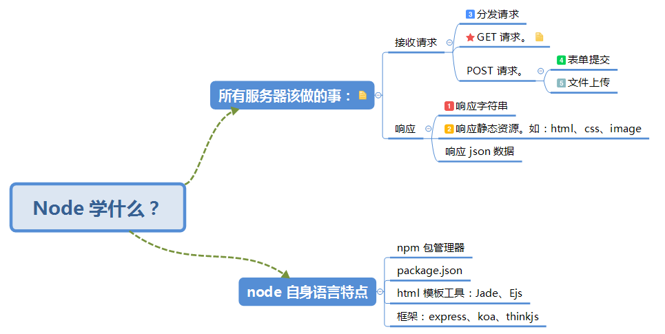

# learn-node

- 第一部分 使用 Node 完成服务器端语言该做的事情 —— 原生写法

    - learn-http
        
        - 学习 GET 请求，如何获取 GET 请求参数；
        - 几种常见的响应：响应字符串、响应 html、响应 json 数据。
        
    - learn-router
    
        - 路由分发，不同的请求跳转不同的处理，返回不同的页面。
        
    - learn-form
    
        - POST 请求之表单提交，以及如何接收 POST 请求的参数。
        
    - learn-upload
    
        - POST 请求之文件上传。
        
    - test1
    
        - 实战：使用 node 原生技术，总结前面学到的技术，完成一个文件系统的展示与上传的功能。

